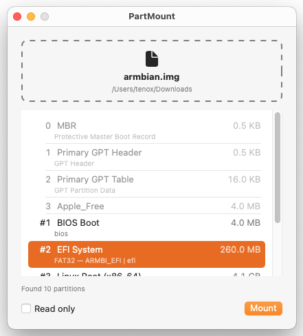

# PartMount

A disk image partition mounter for macOS. 

Lets you select a partition of a disk image like `.img` to be individually mounted. Useful for mounting FAT partitions in in EFI or ARM SBC disk images.

